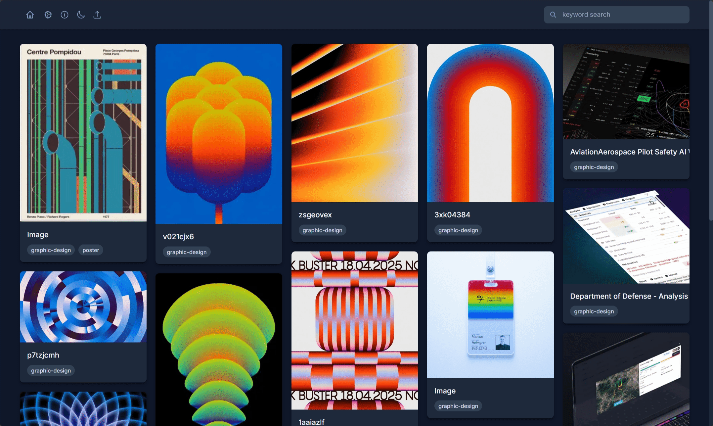

# Eagle Web Gallery

A web interface for remotely accessing your [Eagle.cool](https://eagle.cool) library. Access, browse, and upload to your Eagle collection from any device with a web browser.



https://github.com/user-attachments/assets/ffc9e546-b807-4acc-8813-2854cb7a3f15

## Features

### Responsive Interface
- **Responsive Design**: Works on desktop, tablet, and mobile
- **Dark/Light Mode**: Automatic theme detection with manual toggle
- **Masonry Layout**: Eagle-style grid that adapts to screen size
- **Modern UI**: Built with Tailwind CSS

### Smart Browsing
- **Real-time Search**: Find images with debounced search
- **Tag Filtering**: Click any tag to filter your collection
- **Folder Filtering**: Click any folder to filter your collection
- **Shareable Links**: URLs remember your filters, making it easy to bookmark or possible share specific views

### Remote Upload
- **Secure Upload**: PNG image upload with metadata removal (using ffmpeg)
- **Direct Integration**: Uploads go straight to your Eagle library
- **Progress Feedback**: Visual confirmation of uploads

### Performance
- **Lightweight**: Binary less than 4MB (compressed with UPX)
- **Fast**: Direct integration with Eagle's native API
- **Minimal Dependencies**: Self-contained Go application
- **Lazy Loading**: Images load only when needed
- **Pagination**: Load more items as you scroll

Note: I don't foresee it being a problem, but currently, we load
the <library>/images/<id>/*_thumbnail.png without any checks for size.
Let me know your experience on data/metered networks if you have any problems
by creating an issue

-> http://github.com/eissar/eagle-web/issues/new


## Quick Start

### Prerequisites

1. **Eagle.cool** must be installed and running
   - Download from [eagle.cool](https://eagle.cool)
   - Ensure Eagle is running

2. **FFmpeg** (for image upload security)
   - **Windows**: Download from [ffmpeg.org](https://ffmpeg.org/download.html#build-windows) or install via Chocolatey: `choco install ffmpeg`
   - **macOS**: Install via Homebrew: `brew install ffmpeg`
   - **Linux**: Install via package manager: `sudo apt install ffmpeg` (Ubuntu/Debian)

   note: if you don't plan on uploading anything, you can skip installing this/ install it later.

### Installation & Setup

1. **Download the latest release** from the [releases page](../../releases)

2. **Run the application**:
   ```bash
   # Windows
   ./eagle-web.exe

   # macOS/Linux
   ./eagle-web
   ```

3. **Access the gallery**:
   - Open your browser to `http://localhost:8081/gallery` / http://<IP>:8081/gallery
   - Start browsing your Eagle collection

## Remote Access Setup

To access your Eagle library from other devices:

### Option 1: Tailscale (Recommended)

[Tailscale](https://tailscale.com) provides secure remote access:

1. **Install Tailscale** on the computer running Eagle Web:
   - Visit [tailscale.com/download](https://tailscale.com/download)
   - Follow the setup instructions

2. **Install Tailscale** on your mobile device or remote computer

3. **Access your gallery** using your Tailscale IP:
   ```
   http://[your-tailscale-ip]:8081/gallery
   ```

### Option 2: Cloudflare Tunnel

For more advanced users, [Cloudflare Tunnel](https://developers.cloudflare.com/cloudflare-one/connections/connect-apps/) provides public access:

1. Install `cloudflared`
2. Set up a tunnel to `localhost:8081`
3. Access via your Cloudflare tunnel URL

### Option 3: Port Forwarding

Configure your router to forward port 8081 to your computer (less secure, not recommended).

## Technical Details

### Architecture
- **Backend**: Go web server with embedded templates
- **Frontend**: HTMX for interactivity, Tailwind CSS for styling
- **API Integration**: Direct connection to Eagle's native API (`http://127.0.0.1:41595`)
- **Image Serving**: Optimized thumbnail delivery

### Security Features
- **Metadata Removal**: Uploaded images are processed with FFmpeg to remove EXIF data
- **File Type Validation**: Currently limited to PNG uploads
- **Local Processing**: All image processing happens locally

### Browser Support
- Chrome/Chromium 90+
- Firefox 88+
- Safari 14+
- Edge 90+

## Security Considerations

**Important**: This application provides **no authentication or authorization**. Anyone with access to the web interface can:
- View your entire Eagle library
- Upload new images
- Browse all tags and folders

- Use only on trusted networks or with a vpn
- Don't expose directly to the public internet

## Known Issues & Limitations

- **Upload Format**: Currently only PNG files are supported for upload
- **Eagle Dependency**: Eagle.cool must be running for the web interface to work
- **API Reliability**: Occasionally Eagle's API may become unresponsive
I can't reproduce this yet, but sometimes the eagle api server will become unresponsive with no explanation.
to solve this, the only solution I've found is to restart the actual app.
- **Load Per Page**: the load per page button does nothing

## Roadmap

- [ ] **Expanded Upload Support**: JPEG, GIF, WebP support
- [ ] **PWA Features**: Progressive Web App with offline capabilities
- [ ] **Mobile Share Integration**: "Share to Eagle" from mobile browsers
- [ ] **Basic Authentication**: Optional password protection
- [ ] **Bulk Operations**: Multi-select and batch actions

## Contributing

Please feel free to submit issues and pull requests.
( the html and styling is very disorganized )

### Building Locally

TODO

## Acknowledgments

- [Eagle.cool](https://eagle.cool) for the asset management application
- [HTMX](https://htmx.org) for simplifying frontend interactivity
- [Tailwind CSS](https://tailwindcss.com) for the CSS framework
- [Heroicons](https://heroicons.com) for the icon set
